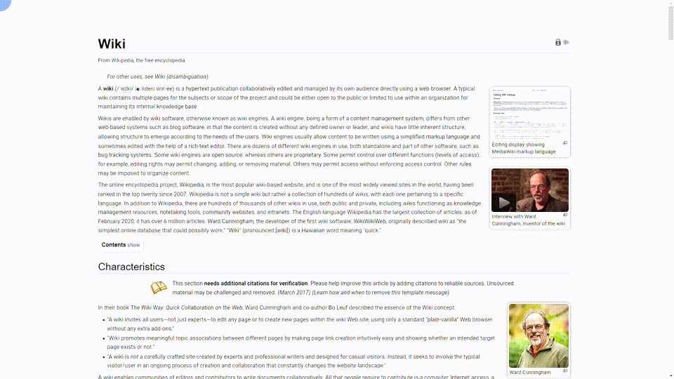

# [Wikipedia](https://www.wikipedia.org/) beautifier for [Google Chrome](https://www.google.com/chrome/) 

Very lightweight and easy-to-use 
Chrome Extension with pretty styles for wikipedia 

It can simplify a Wiki page view for better reading experience: 
* no links highlighting
* no superscripts
* no unnecessary menus. only the content of an article

You can toggle these changes 
by clicking the upper left corner: 
